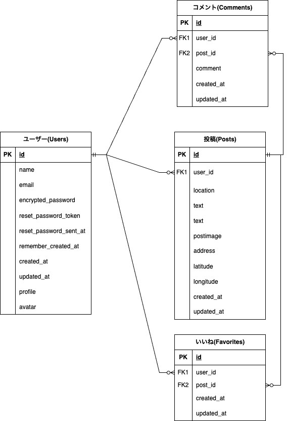

# Cycling Life
スマホなどで撮影した画像を投稿できるアプリです。  
撮影した画像を他のユーザーと共有することができます。  
撮影した場所の住所を入力することで、Gogle Mapを表示することもできます。  

 https://cyclinglife-e347f543e037.herokuapp.com/  
画面上部右にある"ゲストログイン"からユーザー登録なしにゲストユーザーとしてログインできます。

# 開発経緯
以前のコロナ感染拡大時に人との密状態を避けるため、通勤通学の手段として自転車の利用が推奨されたことがありました。  
その後感染は縮小傾向になりましたが、中にはそれをきっかけに趣味・あるいは健康のために  
継続して自転車を日常的に利用する人もいるでしょう。私自身がそうでした。  
そのような人達のために行く先々でのお気に入りの場所を共有できるサイトがあれば便利かと思い、このアプリを開発しました。    
例えば駐輪場が完備されている施設や、サイクリング中に見つけた景色、  
パンクした時に立ち寄れる自転車屋さんなどの情報が分かれば、自転車に乗ることがより楽しくなるかと思います。  
このアプリを通じて自転車を利用する人達全ての助けになれば幸いです。

# 使用技術

  * HTML  
  * CSS  
  * JavaScript  
  * Bootstrap5  
  * Ruby 3.0.6  
  * Ruby on rails 7.0.8  
  * PostgreSLQ  
  * Heroku  
  * AWS S3  
  * Rspec
  * Google maps API

# 構成図
 

 
# ER図

 
# 機能一覧

 | 機能 | 説明 |
----|---- 
| ユーザー登録 | ユーザー名・アバター画像・プロフィール文の設定ができます。　|
| ログイン機能(devise) | メールアドレス・パスワードの入力でログインできます。 |
| ゲストログイン | ユーザー登録をせずにアプリ内の機能を試用することができます。 |
| 投稿機能 | ファイルから画像を選択し、アップロードできます。  また、住所を入力すると詳細画面にGooglemapを表示させることができます。(任意)|
| コメント機能 | 投稿に対してコメントすることができます。|
| いいね機能 | 気に入った投稿に対していいねボタンを押すことができます。 |
| 検索機能 | 撮影場所名についてフリーワード検索をすることができます。 |
| レスポンシブ対応 | 使用する端末の画面サイズに合わせて表示します。 |

# 工夫したこと
 * 外出先でも利用できるようにスマホサイズに合わせてレスポンシブ表示されるようにした。
 * GoogleMapAPIを取り入れ、投稿したい場所の正確な位置が分かるようにした。
 * ユーザーが利用しやすいように、サイトの構成を可能な限りシンプルなものにした。
 * 視覚的に判断しやすいようにFont Awesomeを導入し、リンクボタンにアイコンを表示させた。

# 今後実装したい機能
 * ユーザーのフォロー機能
 * 投稿の下書き機能

