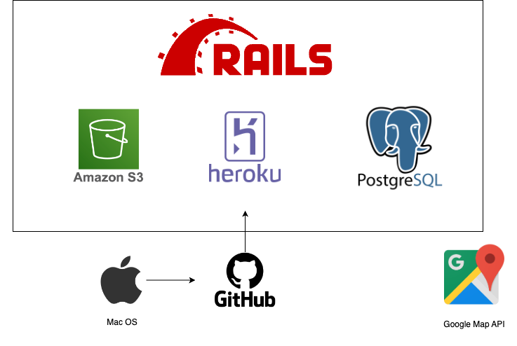
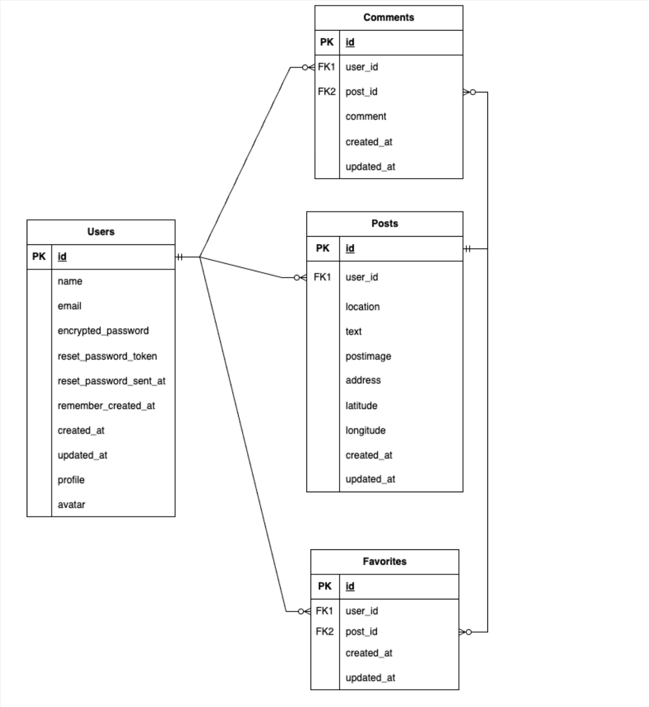

# Cycling Life
景色の画像投稿サイトです。  
撮影した画像を他のユーザーに共有することができます。  
撮影した場所の住所を入力することで、Gogle Mapを表示することもできます。  

# URL
 https://cyclinglife-e347f543e037.herokuapp.com　  
画面上部右のタブからユーザー登録をすることなくゲストユーザーとしてログインできます。
 
# 使用技術

  * HTML  
  * CSS  
  * JavaScript  
  * Bootstrap5  
  * Ruby 3.0.6  
  * Ruby on rails 7.0.8  
  * PostgreSLQ  
  * Heroku  
  * AWS S3  
  * Rspec
  * Google maps API

# 構成図
 

 
# ER図
 
 
# 機能一覧

 | 機能 | 説明 |
----|---- 
| ユーザー登録 | ユーザー名・アバター画像・プロフィール文の設定ができます。　|
| ログイン機能(devise) | メールアドレス・パスワードの入力でログインできます。 |
| ゲストログイン | ユーザー登録をせずにアプリ内の機能を試用することができます。 |
| 投稿機能 | ファイルから画像を選択し、アップロードできます。  また、任意で住所を入力すると詳細画面にGooglemapを表示させることができます。|
| コメント機能 | 投稿に対してコメントすることができます。|
| いいね機能 | 気に入った投稿に対していいねボタンを押すことができます。 |  
| 検索機能 |　撮影場所名をフリーワード検索することができます。　|
| レスポンシブ対応 | 画面のサイズに合わせて表示させることができます。 |
# Note
 
注意点などがあれば書く
 
# Author
 
作成情報を列挙する
 
* 作成者
* 所属
* E-mail
 
# License
ライセンスを明示する
 
"hoge" is under [MIT license](https://en.wikipedia.org/wiki/MIT_License).
 
社内向けなら社外秘であることを明示してる
 
"hoge" is Confidential.

